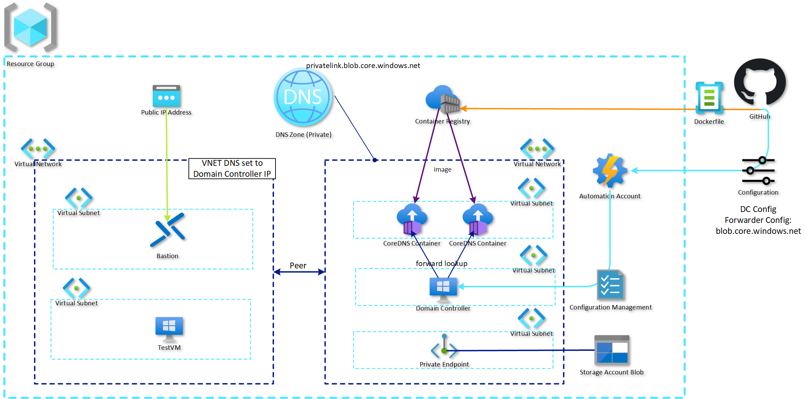

# CoreDNS Fowarder Private Endpoint and Private DNS Lab Environment

## About
This project will build the networking and infrastructure resources to test using CoreDNS containers running in Azure Container Instance as a DNS forwarder to resolve Private Endpoint/Private Link services in Azure Private DNS using typical enterprise custom DNS services like ADDS DNS.

## Requirements
Azure [CLI](https://aka.ms/az-cli) or Azure [PowerShell](https://www.powershellgallery.com/packages/Az) and
[Bicep](https://learn.microsoft.com/en-us/azure/azure-resource-manager/bicep/install)

### What is deployed
The project will deploy the shown logical architecture to facilitate further testing of additional capabilities:

